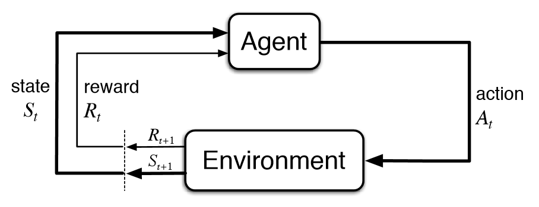



Personalized medicine typically takes one of two forms: (i) identifying subgroups of patients who benefit from a particular treatment, or (ii) determining the optimal treatment for an individual patient. My primary interest lies in the latter, the intersection of personalized medicine and reinforcement learning, where I focus on developing novel statistical methods to estimate optimal, adaptive interventions tailored to the uniquely evolving health status of each patient over time.

  

<!--
My work focuses on Dynamic Treatment Regimes (DTRs) to improve individualized care through data-driven treatment strategies. We have dervied generalization error bounds of the estimated DTR in the setting of finite number of stages with multiple treatment options, contributing to the theoretical advancements in the field. We have also developed an individualized recommender system for apps in the IntelliCare ecosystem, which is a suite of health apps for users with depression and anxiety disorders.
-->
* __Oh, E. J.,__ Qian, M., and Cheung, Y. K. (2022). Generalization error bounds of dynamic treatment regimes in penalized regression-based learning. _Annals of Statistics_, 50(4), 2047-2071. [[pdf]](https://par.nsf.gov/servlets/purl/10429985)
* __Oh, E. J.,__ Qian, M., Cheung, K., and Mohr, D. C. (2020). Building health application recommender system using partially penalized regression. _Statistical Modeling in Biomedical Research_, Springer, 105-123.

